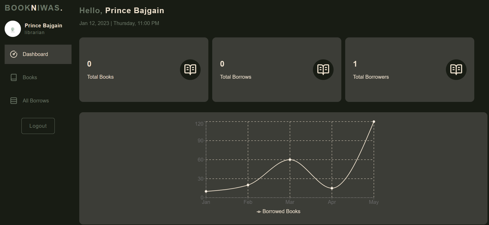
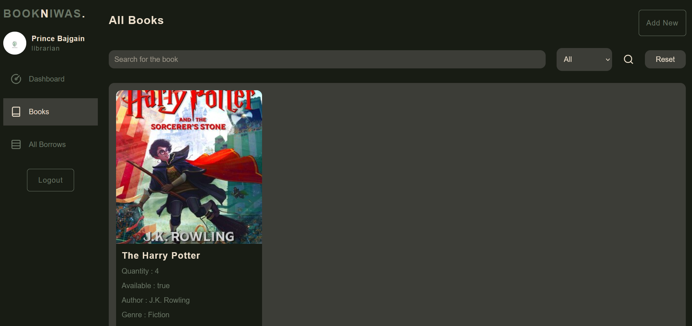

# BookNiwas

BookNiwas is a full-stack library management system that allows users to manage books, borrow records, and user accounts efficiently. It features authentication, role-based access, and a responsive interface with profile picture support.

---

## Features

- **Authentication & Authorization**
  - User registration and login
  - Role-based access: Admin, Borrower
  - JWT-based authentication
  - Profile picture support

- **Book Management**
  - Add, view, and manage books
  - Search and filter books

- **Borrow Management**
  - Track all borrow records
  - Role-based visibility

- **Dashboard**
  - View statistics about books and borrows
  - Sidebar navigation with active link highlighting

- **Security**
  - Password hashing with bcrypt
  - Secure cookies with `httpOnly` and `SameSite` options

---

## Technologies Used

- **Frontend**
  - React
  - React Router DOM
  - Axios
  - TailwindCSS
  - Lucide React icons
  - react-hot-toast

- **Backend**
  - Node.js & Express
  - MongoDB & Mongoose
  - JWT for authentication
  - bcrypt for password hashing
  - multer for file uploads

---

## Screenshots

  
*Login page with responsive layout.*

  
*Dashboard with statistics and sidebar.*

  
*Manage books with search and filter.*

  
*View all borrow records.*

---

## Installation

### Backend

1. Clone the repository:
   ```bash
   git clone https://github.com/mainprins/bookniwas-Website-.git
   cd bookniwas/backend
